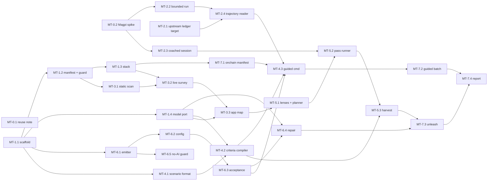

# Epics

Each epic file has an outcome, the milestones it serves, and stories. A story is the unit
of work for one agent and one PR.

## Story format

```markdown
### MT-<epic>.<n> Title
- [ ] done

**Outcome.** What is true afterwards, in one or two sentences.
**Depends on.** Stories that must land first.
**Touches.** Files and folders this story creates or changes.
**Done when.** Objective checks. Each one is a named test, a command with an expected
result, or a file that must exist. This list is the contract.
**Notes for the implementer.** Traps, facts, and pointers that save time.
**Questions.** Empty until the implementer is blocked (see AGENTS.md).
```

Story IDs are permanent. If a story is split, keep the ID on the first part and add
new IDs for the rest. If a story is dropped, mark it `dropped` with the reason.

## Index

| Epic | Outcome | Milestone | Stories |
| --- | --- | --- | --- |
| [E0 Reuse and spikes](E0-reuse-and-spikes.md) | We know what to call instead of build, and Magpi's run paths are confirmed | M1 | MT-0.1, MT-0.2 |
| [E1 Foundation](E1-foundation.md) | Repo, manifest, answer-key guard, stack control, model port | M1 | MT-1.1 - MT-1.4 |
| [E2 Magpi bridge](E2-magpi-bridge.md) | Magpi runs can be started and read back as trajectories | M1 | MT-2.1 - MT-2.4 |
| [E3 Discovery](E3-discovery.md) | Dropped on a repo, it finds the UI surface and critical paths | M1 | MT-3.1 - MT-3.3 |
| [E4 Guided authoring](E4-guided.md) | Human scenarios become accepted specs | M1 | MT-4.1 - MT-4.3 |
| [E5 Coached exploration](E5-exploration.md) | Multi-lens coached Magpi passes become candidate scenarios and specs | M1 | MT-5.1 - MT-5.3 |
| [E6 Synthesis and acceptance](E6-synthesis-and-acceptance.md) | Trajectories become Playwright specs that prove themselves without AI | M1 | MT-6.1 - MT-6.5 |
| [E7 Dogfood: onchain-invoice](E7-dogfood-onchain-invoice.md) | M1 is demonstrated on a real product | M1 | MT-7.1 - MT-7.4 |
| [E8 Knowledge](E8-knowledge.md) | Second runs skip rediscovery | M2 | sketch |
| [E9 Fixtures and hard flows](E9-fixtures-and-hard-flows.md) | Passkeys, wallet, settlement via project helpers | M3 | sketch |
| [E10 Incremental maintenance](E10-incremental.md) | Changes trigger targeted exploration and repair | M4 | sketch |
| [E11 Evaluation](E11-evaluation.md) | Scored against the hidden suite and brief metrics | M5 | sketch |
| [E12 Models and cost](E12-models-and-cost.md) | Cheapest viable model per role | M2+ | sketch |

## Dependency graph (M1)


