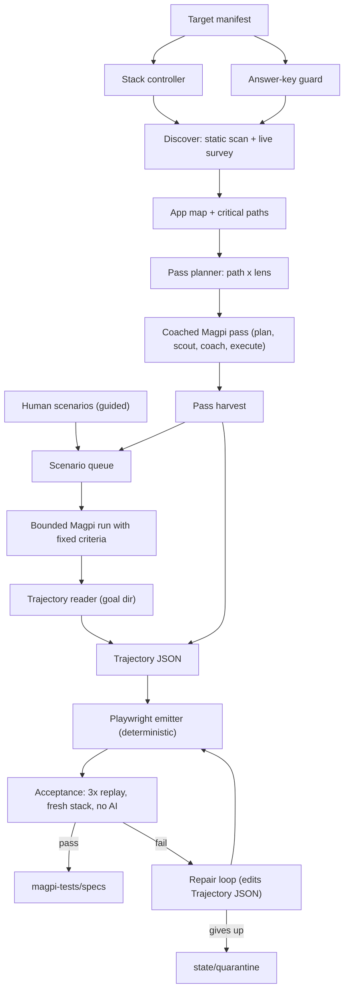

# Architecture (M1)

Status: **proposed (M1)**. Decisions: QD1-QD9 in [../decisions.md](../decisions.md).
Change this file when a spike proves something different; say what changed and why.

## One picture

Everything left of "Trajectory JSON" may use AI. Everything right of it is
deterministic, except the repair loop, which may only edit Trajectory JSON (QD4).

## The two front doors

**Guided.** A human writes `magpi-tests/scenarios/<name>.md`: what to test, steps,
expected outcome. The criteria compiler turns the expected outcome into Magpi predicates
and writes them into the scenario JSON *before* the run, so the executor never decides
what success is (Magpi D20). Then the shared pipeline runs.

**Explore.** Discovery produces an app map with critical paths. The pass planner crosses
each path with a few lenses (happy path, invalid input, empty or error state, alternate
entry, deep end-to-end). Each pass is one coached Magpi session: Magpi's planner
classifies the objective, and for unknown routes inserts scout → coach → execute (Magpi
D58). A pass outputs (a) trajectories for flows it completed with criteria satisfied,
and (b) new scenario candidates it noticed but did not finish. Candidates go back
through the bounded-run path so every test still has fixed, external criteria.

## Modules

Code layout for this repo. One folder per module, each with a small public `index.ts`.

| Module | Responsibility | Stories |
| --- | --- | --- |
| `src/cli/` | `magpi-test` commands, argument parsing, exit codes | MT-1.1, MT-4.3, MT-7.3 |
| `src/config/` | Load and validate the target manifest | MT-1.2 |
| `src/files/` | The only module that reads target files; enforces answer-key globs | MT-1.2 |
| `src/stack/` | Start, wait for ready, stop the target's processes | MT-1.3 |
| `src/model/` | `ModelClient` port, OpenRouter adapter, fake for tests | MT-1.4 |
| `src/magpi/` | Everything that calls Magpi: bounded run, coached session, goal-dir reader | MT-2.2, MT-2.3, MT-2.4 |
| `src/discover/` | Static scan, live survey, app map, critical paths | MT-3.x |
| `src/scenario/` | Scenario format, parser, criteria compiler | MT-4.x |
| `src/explore/` | Lenses, pass planner, pass runner, harvest | MT-5.x |
| `src/synth/` | Trajectory → Playwright source, generated config, no-AI guard | MT-6.1, 6.2, 6.5 |
| `src/accept/` | Run Playwright, classify results, repair loop, quarantine | MT-6.3, MT-6.4 |
| `src/state/` | Read and write `magpi-tests/state/` (JSON files, one per record) | used by all |
| `src/report/` | M1 run report | MT-7.4 |

Dependency rule: `synth` and `accept` must not import `model`, except `accept/repair.ts`.
`magpi` is the only module that spawns Magpi or reads `~/.browser-agent-core`.

## CLI (M1)

| Command | Does |
| --- | --- |
| `magpi-test discover --target <dir>` | Static scan + live survey → `state/app-map.json`, candidate scenarios |
| `magpi-test guided --target <dir> [scenario.md ...]` | Guided scenarios → accepted specs |
| `magpi-test explore --target <dir> [--paths a,b] [--lenses x,y] [--max-passes n]` | Coached passes → trajectories and candidates → accepted specs |
| `magpi-test accept --target <dir>` | Re-run acceptance on everything pending |
| `magpi-test run --target <dir>` | discover + guided + explore + accept + report (the "unleash" command) |

Every command is resumable: state is on disk, and a rerun skips records already
`accepted` or `quarantined` unless `--force`.

## State on disk (`<target>/magpi-tests/state/`)

| File | Written by | Shape |
| --- | --- | --- |
| `app-map.json` | discover | areas, routes, critical paths with priority and `needsFixture` |
| `scenarios/<id>.json` | scenario, explore | `Scenario` ([scenario-and-trajectory.md](scenario-and-trajectory.md)) |
| `runs/<id>.json` | magpi | Magpi goal id, session id, command, exit, timings, tokens, actions |
| `trajectories/<id>.json` | magpi reader, repair | `Trajectory` |
| `quarantine/<id>.json` | accept | trajectory id, last Playwright error, attempts |
| `report.md` | report | human summary |

All writes are whole-file JSON with a `schemaVersion`. No database in M1.

## Models

Magpi uses its own model configuration for browsing (`--model`, profiles). Magpi Test
makes a few small calls of its own (rank critical paths, write scenarios from the app
map, compile expected outcomes into predicates, propose Trajectory repairs). They go
through `src/model/` with one configurable cheap default (`MAGPI_TEST_MODEL`, via
OpenRouter). Each call sends a small local problem, never the whole app map plus
history. Model routing is out of scope for M1.

## What M1 deliberately does not have

A durable knowledge model beyond the files above, change detection, a fixture
framework, parallel browsers, model routing, a UI.
